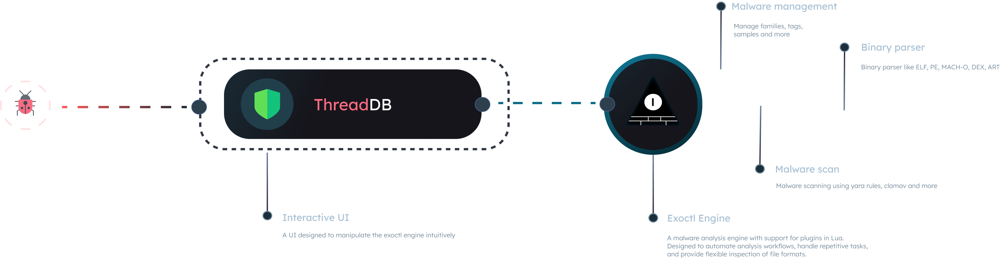

<p align="center"></p>

<h4 align="center">ThreatDB is a software that uses the <a href="https://github.com/exoctl/exoctl" >exoctl</a> engine as a backend to manage malware.</h4>

<p align="center">
  <a href="https://github.com/exoctl/threatdb/actions/workflows/docker-image.yml?query=branch%3Amaster">
    
  </a>
</p>


> [!WARNING]  
> This code was generated by an AI, using https://lovable.dev, any problems and vulnerabilities, report them and I will fix them as soon as possible.


## Setting Up / Building

Running on the host

```
npm run install .
npm run build .
npm run preview
```

Using Dockerfile

```
sudo docker build -t threatdb .
sudo docker run --name threatdb -p 4173:4173  threatdb
```

## What is ThreatDB

Threatdb manages your malware, using exoctl as a backend you can easily manipulate the engine and view analysis made by the engine, such as families and family samples, in addition to manipulating Yara rules and having feedback from antivirus like clamav and more.



There are some plugins that you need to manipulate the engine using ThreatDB, but they are all engine defaults, they are `yara_gate`, `status`, `version` ...

## ThreatDB Features

##### 1. **Interactive Dashboard**
- A centralized, intuitive dashboard (`Dashboard.tsx`) provides an overview of analysis activities, system status, and key metrics, enabling quick access to critical information.

#### 2. **Malware Record Management**
- **View Records**: Browse and manage analysis records with detailed metadata, including file hashes, entropy, and maliciousness status (`Records.tsx`).
- **Edit Records**: Update or annotate existing records to refine analysis results or add custom notes (`EditRecordForm.tsx`).

#### 3. **Detailed File Analysis**
- Inspect comprehensive file details, such as file type, size, hashes (SHA256, SHA1, etc.), entropy, and TLSH, with a dedicated view for in-depth analysis (`FileDetails.tsx`).

#### 4. **Real-Time Malware Scanning**
- Perform on-demand file scanning with integration to the analysis engine, supporting automated detection of malicious content (`Scanner.tsx`).

#### 5. **YARA Rule Management**
- **Create and Manage YARA Rules**: Define, view, and organize custom YARA rules for advanced malware detection (`YaraRules.tsx`).
- **Rule Details**: Inspect specific YARA rule configurations and their matching results for precise analysis (`YaraRuleDetails.tsx`).

#### 6. **Threat Taxonomy**
- Categorize and manage malware families and tags to organize threats systematically, with support for creating and associating custom families and tags (`ThreatTaxonomy.tsx`).

#### 7. **Plugin System**
- Verify the engine's functionality with Lua-based plugins, allowing automation of repetitive tasks and integration with custom workflows (`Plugins.tsx`).

#### 8. **System Status Monitoring**
- Monitor the engine's operational status, including connectivity, performance, and service health, ensuring reliable operation (`Status.tsx`).

#### 9. **Customizable Settings**
- Configure the engine and interface settings to tailor the platform to your specific needs, such as API endpoints, plugin configurations, or UI preferences (`Settings.tsx`).

#### 13. **Docker Support**
- Easily deploy the engine using Docker, with a pre-configured `Dockerfile` for consistent builds and deployments across environments.


<iframe width="560" height="315" src="https://www.youtube.com/embed/veUWvfSlv2M" title="ThreatDB - Detect Samples Families" frameborder="0" allow="accelerometer; autoplay; clipboard-write; encrypted-media; gyroscope; picture-in-picture; web-share" allowfullscreen></iframe>